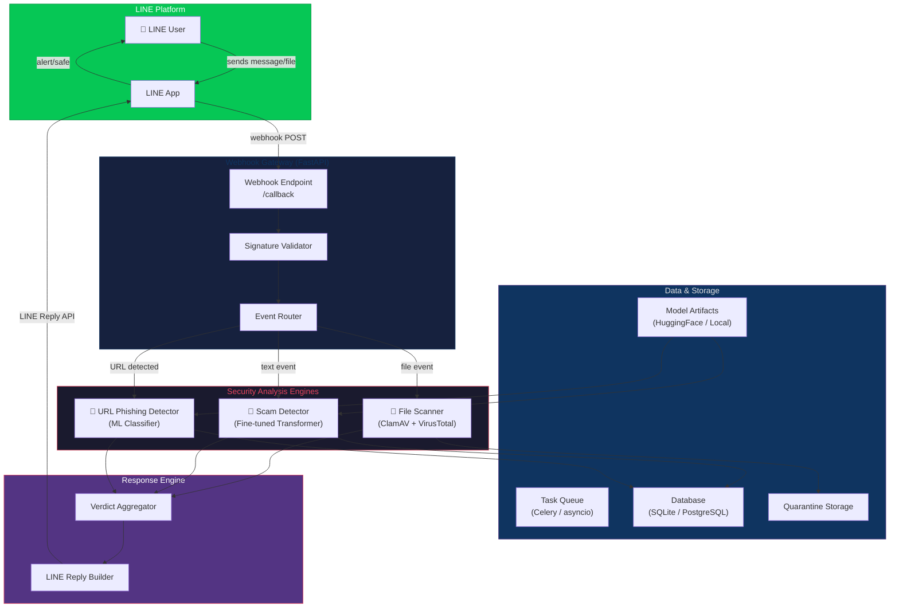
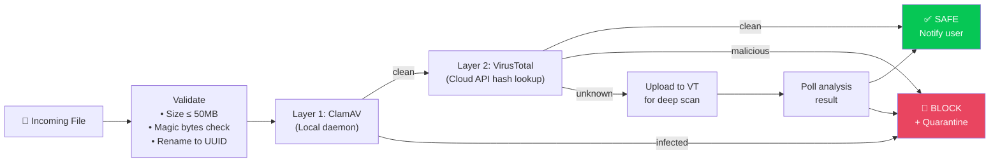
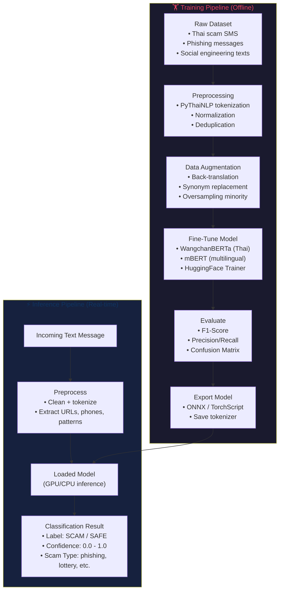
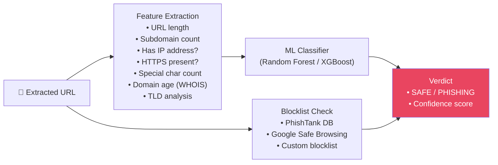
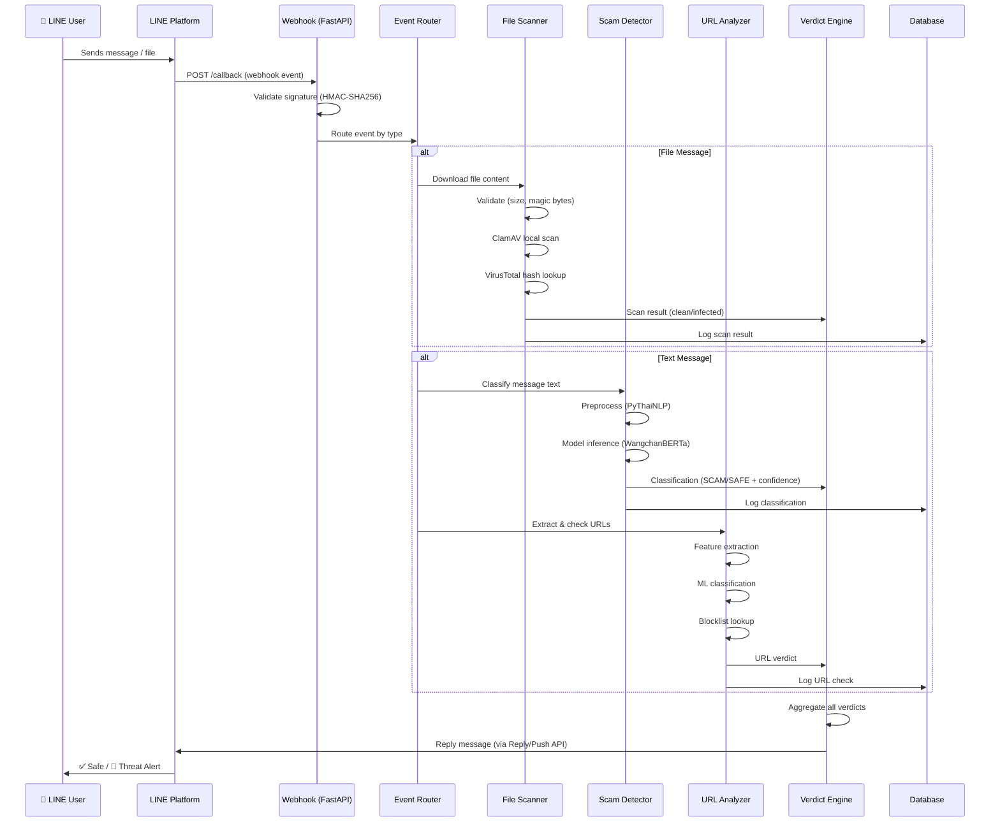

# 🛡️ LINE ChatGuard — System Architecture Plan

> **Project:** UTCC Hackathon — AI Model for Personal Security  
> **Goal:** A LINE chatbot that acts as a real-time cybersecurity firewall — scanning files for malware, detecting scam messages via NLP, and flagging phishing URLs.

---

## 1. High-Level System Overview



---

## 2. Core Components

### 2.1 LINE Messaging API Integration

| Item | Detail |
|:---|:---|
| **SDK** | `line-bot-sdk-python` (v3.x, async support) |
| **Webhook Framework** | FastAPI (async, high performance) |
| **Auth** | Channel Secret signature validation (HMAC-SHA256) |
| **Content Download** | `GET https://api-data.line.me/v2/bot/message/{messageId}/content` |
| **Reply** | Reply Token (30-sec TTL) → use Push API for async results |

**Handled Webhook Events:**

| Event Type | Trigger | Action |
|:---|:---|:---|
| `message.text` | User sends text | → Scam NLP + URL extraction |
| `message.file` | User sends a file | → Download → Virus scan |
| `message.image` | User sends an image | → Steganography check (optional) |
| `message.video` | User sends a video | → File hash scan |
| `follow` | User adds bot | → Welcome + setup instructions |
| `postback` | User taps rich menu | → Settings / report history |

---

### 2.2 File Virus Scanner

A **dual-layer** scanning architecture for maximum coverage:



**Technology Stack:**

| Layer | Technology | Purpose |
|:---|:---|:---|
| **Local AV** | ClamAV (`clamd` daemon + `pyclamd` Python client) | Fast, offline first-pass scan |
| **Cloud AV** | VirusTotal API v3 (`vt-py`) | 70+ AV engine aggregated verdict |
| **File Handling** | `python-magic`, `uuid`, temp storage | Type validation, safe naming |
| **Quarantine** | Isolated directory with restricted permissions | Store flagged files for review |

**Scanning Pipeline:**

1. Receive file via LINE webhook → download binary via content API
2. **Validate:** Check size limit, verify magic bytes match claimed MIME type
3. **Rename:** Save as `{uuid}.{ext}` in temp quarantine directory
4. **Layer 1 — ClamAV:** Scan with local `clamd` daemon (fast, ~100ms)
5. **Layer 2 — VirusTotal:** Compute SHA-256 hash → lookup via VT API
   - If hash found → return cached verdict (70+ engines)
   - If hash not found → upload file for full analysis, poll for results
6. **Verdict:** Aggregate results → reply to user with threat level

---

### 2.3 Scam Message Detection (NLP Engine)

> **Core Idea:** Fine-tune a pre-trained transformer model to classify messages as `SCAM` vs `SAFE`, with a confidence score and scam-type label.



**Model Selection Strategy:**

| Model | Use Case | Pros |
|:---|:---|:---|
| **WangchanBERTa** (`airesearch/wangchanberta-base-att-spm-uncased`) | Thai-primary messages | SOTA Thai NLP, pre-trained on Thai corpus |
| **mBERT / XLM-RoBERTa** | Multilingual / English | Handles mixed-language messages |
| **Ensemble** | Production | Combine both for maximum coverage |

**Scam Categories to Detect:**

| Category | Example Pattern |
|:---|:---|
| 🎰 Lottery/Prize Scam | "คุณได้รับรางวัล..." (You've won a prize...) |
| 🏦 Banking Phishing | "บัญชีของคุณถูกระงับ..." (Your account is suspended...) |
| 💰 Investment Fraud | "รายได้ passive 100,000 บาท/เดือน" |
| 🔗 Link Bait | "คลิกที่นี่เพื่อรับ..." (Click here to receive...) |
| 👤 Impersonation | "ผมจากธนาคาร..." (I'm from the bank...) |
| 📦 Package/Delivery Scam | "พัสดุของคุณถูกกักไว้..." |

**Training Data Sources:**

- Thai SMS spam datasets (Kaggle, open research datasets)
- Curated scam message corpora (manually labeled)
- Synthetic data generation via back-translation
- Community-reported scam messages (with consent)

---

### 2.4 URL Phishing Detector



**Feature Engineering (22+ features):**

| Feature Group | Features |
|:---|:---|
| **Lexical** | URL length, dot count, slash count, `@` presence, `//` redirect, hyphen count |
| **Domain** | Domain age, registrar, WHOIS privacy, subdomain depth |
| **Content** | Has login form, favicon mismatch, iframe redirect |
| **Network** | SSL certificate validity, DNS record age, IP geolocation |
| **Statistical** | Entropy of URL string, n-gram frequency |

---

## 3. Project Directory Structure

```
UTCC-Hackathon/
├── main.py                          # Application entry point
├── pyproject.toml                   # Dependencies (uv managed)
├── .env.example                     # Environment variable template
│
├── app/                             # Core application package
│   ├── __init__.py
│   ├── config.py                    # Settings & env loading
│   ├── webhook.py                   # FastAPI webhook handler
│   └── line_client.py               # LINE API client wrapper
│
├── scanners/                        # Security analysis engines
│   ├── __init__.py
│   ├── file_scanner.py              # ClamAV + VirusTotal integration
│   ├── scam_detector.py             # NLP scam message classifier
│   ├── url_analyzer.py              # URL phishing detector
│   └── verdict.py                   # Aggregated verdict builder
│
├── models/                          # ML/NLP model management
│   ├── __init__.py
│   ├── scam_nlp/
│   │   ├── train.py                 # Fine-tuning script
│   │   ├── dataset.py               # Dataset loading & preprocessing
│   │   ├── inference.py             # Model inference wrapper
│   │   └── config.yaml              # Training hyperparameters
│   └── url_classifier/
│       ├── train.py                 # URL classifier training
│       ├── features.py              # Feature extraction
│       └── inference.py             # URL classification inference
│
├── data/                            # Training data & datasets
│   ├── scam_messages/
│   │   ├── raw/                     # Raw collected data
│   │   ├── processed/               # Cleaned & tokenized data
│   │   └── augmented/               # Augmented training data
│   └── phishing_urls/
│       ├── raw/
│       └── processed/
│
├── storage/                         # Runtime storage
│   ├── quarantine/                  # Quarantined malicious files
│   ├── temp/                        # Temporary file processing
│   └── model_artifacts/             # Saved model weights
│
├── tests/                           # Test suite
│   ├── test_file_scanner.py
│   ├── test_scam_detector.py
│   ├── test_url_analyzer.py
│   └── test_webhook.py
│
├── scripts/                         # Utility scripts
│   ├── setup_clamav.sh              # ClamAV installation script
│   ├── collect_data.py              # Data collection utilities
│   └── evaluate_models.py           # Model evaluation & metrics
│
└── docs/                            # Documentation
    ├── api_reference.md
    └── deployment_guide.md
```

---

## 4. Technology Stack

| Category | Technology | Version | Purpose |
|:---|:---|:---|:---|
| **Runtime** | Python | 3.13+ | Core language |
| **Package Manager** | uv | latest | Fast dependency management |
| **Web Framework** | FastAPI | 0.115+ | Async webhook server |
| **LINE SDK** | line-bot-sdk | 3.x | LINE Messaging API integration |
| **NLP Framework** | HuggingFace Transformers | 5.7+ | Model loading, fine-tuning, inference |
| **Thai NLP** | PyThaiNLP | 5.x | Thai text tokenization & preprocessing |
| **Base Model** | WangchanBERTa | - | Thai language understanding |
| **ML Framework** | PyTorch | 2.11+ | Model training & inference |
| **Classical ML** | scikit-learn | 1.8+ | URL phishing classifier |
| **Antivirus** | ClamAV + pyclamd | - | Local file virus scanning |
| **Cloud AV** | VirusTotal (vt-py) | 3.x | Cloud-based multi-engine scan |
| **Database** | SQLite → PostgreSQL | - | Scan logs, user settings, blocklists |
| **Task Queue** | asyncio (built-in) | - | Async scan orchestration |
| **Deployment** | Docker + ngrok (dev) | - | Containerized deployment |

---

## 5. Data Flow — Complete Request Lifecycle



---

## 6. API & Environment Configuration

### Required Environment Variables

```bash
# .env

# === LINE API ===
LINE_CHANNEL_ACCESS_TOKEN=your_channel_access_token
LINE_CHANNEL_SECRET=your_channel_secret

# === VirusTotal ===
VIRUSTOTAL_API_KEY=your_vt_api_key

# === ClamAV ===
CLAMAV_HOST=localhost
CLAMAV_PORT=3310

# === Application ===
APP_HOST=0.0.0.0
APP_PORT=8000
DEBUG=false
LOG_LEVEL=INFO

# === Model Paths ===
SCAM_MODEL_PATH=storage/model_artifacts/scam_detector
URL_MODEL_PATH=storage/model_artifacts/url_classifier

# === Database ===
DATABASE_URL=sqlite:///storage/chatguard.db
```

---

## 7. Implementation Roadmap

### Phase 1 — Foundation (Week 1)
- [x] Project skeleton (already started)
- [ ] FastAPI webhook server setup
- [ ] LINE SDK integration (receive messages, reply)
- [ ] Signature validation middleware
- [ ] Basic event routing (text, file, image)
- [ ] Environment config management

### Phase 2 — File Scanner (Week 1-2)
- [ ] ClamAV daemon setup + `pyclamd` integration
- [ ] VirusTotal API integration (`vt-py`)
- [ ] File download from LINE Content API
- [ ] File validation pipeline (size, magic bytes, rename)
- [ ] Dual-layer scan orchestration
- [ ] Quarantine storage system
- [ ] Scan result reply messages (with Flex Messages)

### Phase 3 — Scam NLP Engine (Week 2-3)
- [ ] Dataset collection & curation (Thai scam messages)
- [ ] Data preprocessing pipeline (PyThaiNLP)
- [ ] Fine-tune WangchanBERTa on scam classification
- [ ] Model evaluation (F1, Precision, Recall)
- [ ] Export model for inference (ONNX/TorchScript)
- [ ] Real-time inference integration
- [ ] Confidence thresholding & multi-label support

### Phase 4 — URL Phishing Detector (Week 3)
- [ ] Feature extraction module (22+ URL features)
- [ ] Training pipeline (Random Forest / XGBoost)
- [ ] Blocklist integration (PhishTank, custom)
- [ ] Real-time URL extraction from text messages
- [ ] Classification integration with verdict engine

### Phase 5 — Polish & Deploy (Week 4)
- [ ] Rich LINE Flex Messages for threat alerts
- [ ] Rich Menu for user interaction (scan history, settings)
- [ ] Docker containerization
- [ ] Deployment (cloud VM / ngrok for demo)
- [ ] Logging, monitoring & error handling
- [ ] End-to-end testing
- [ ] Documentation & demo video

---

## 8. Reply Message Design (LINE Flex Messages)

### Threat Alert Example

```
┌─────────────────────────────────┐
│  🚨 THREAT DETECTED             │
│─────────────────────────────────│
│                                 │
│  📁 File: document.pdf          │
│  ⚠️  Threat: Trojan.GenericKD   │
│  🔴 Risk Level: HIGH            │
│  🔬 Engines: 47/72 flagged      │
│                                 │
│  The file has been quarantined  │
│  and will not be delivered.     │
│                                 │
│  ┌───────────┐ ┌──────────────┐ │
│  │  Details   │ │ Report False │ │
│  │           │ │  Positive    │ │
│  └───────────┘ └──────────────┘ │
└─────────────────────────────────┘
```

### Scam Alert Example

```
┌─────────────────────────────────┐
│  ⚠️ SCAM WARNING                │
│─────────────────────────────────│
│                                 │
│  🧠 Analysis: 94.7% confidence  │
│  🏷️  Type: Banking Phishing     │
│                                 │
│  "บัญชีของคุณถูกระงับ กรุณา     │
│   ยืนยันตัวตนที่ลิ้งค์..."       │
│                                 │
│  ⚡ Indicators:                  │
│  • Urgency language detected    │
│  • Suspicious URL found         │
│  • Impersonation pattern        │
│                                 │
│  ┌───────────┐ ┌──────────────┐ │
│  │  Learn    │ │   Block      │ │
│  │  More     │ │   Sender     │ │
│  └───────────┘ └──────────────┘ │
└─────────────────────────────────┘
```

---

## 9. Key Dependencies to Add

```bash
# Add to pyproject.toml via uv
uv add fastapi uvicorn[standard]       # Web framework
uv add line-bot-sdk                     # LINE API
uv add pyclamd                          # ClamAV client
uv add vt-py                            # VirusTotal API
uv add python-magic                     # File type detection
uv add pythainlp                        # Thai NLP preprocessing
uv add python-dotenv                    # Environment config
uv add aiohttp aiofiles                 # Async HTTP & file I/O
uv add tldextract                       # URL domain extraction
uv add xgboost                          # URL phishing classifier
uv add joblib                           # Model serialization
uv add sqlalchemy aiosqlite             # Database ORM
```

---

## 10. Security Considerations

| Concern | Mitigation |
|:---|:---|
| **File Bomb (zip bomb)** | Enforce max decompressed size, scan compressed files in sandbox |
| **API Key Exposure** | Store in `.env`, never commit to git, use secrets manager in prod |
| **Webhook Spoofing** | Validate LINE signature on every request |
| **Model Adversarial Attacks** | Ensemble models, confidence thresholding, human review for edge cases |
| **Rate Limiting** | Implement per-user rate limits to prevent abuse |
| **Data Privacy** | Don't persist user messages beyond scan session, comply with PDPA (Thai data protection) |
| **VT API Quota** | Cache hash lookups, use local ClamAV as first layer to reduce API calls |

---

## Open Questions

> **Language Scope:** Should the scam detector support Thai only, or Thai + English (multilingual)? This affects model choice (WangchanBERTa vs mBERT/XLM-R vs ensemble).

> **Deployment Target:** Will this run on a cloud VM (AWS/GCP/DigitalOcean), on-premises, or local machine with ngrok for the hackathon demo?

> **VirusTotal API Key:** The free tier allows only 4 requests/minute and 500/day. For the hackathon demo, should we rely primarily on ClamAV with VT as optional, or do you have a premium VT API key?

> **Training Data:** Do you already have a dataset of Thai scam messages, or should we use publicly available datasets + synthetic generation for the hackathon?

> **LINE Developer Account:** Have you already created a LINE Messaging API channel? We'll need the Channel Secret and Channel Access Token to proceed.
